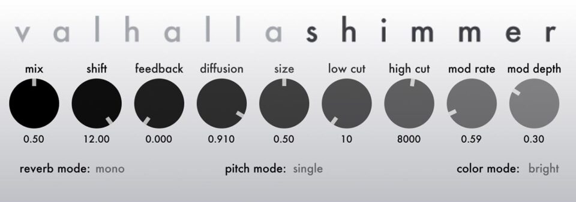

# SHIMMER_EFFECT
###The goal of this project is to recreate a version of the famous shimmer reverb effect using digital audio processing. 

In this project we will explore and implement a basic shimmer reverb effect. This effect has been used by a lot of artists such as Brian Eno, Daniel Lanois, U2, etc... The result of this effect is a very long decay, big reverb effect that can transform a dry guitar sound to an angelic, ambient pad (for example). 

You can check [here](https://youtu.be/KI7by4NOwV0?si=jw2CNXyi32flTsZP) a famous example of this effect used by U2 on the song *"4th of July"*.

There's obviously many ways to get this effect, but the basic fondation of the shimmer is a combination of pitch-shifting, long decay reverb and for most of the time, a feedback loop. 

Too choose a design for our a shimmer, we can take as example the very powerful plugin **ValhallaShimmer** made by ValhallaDSP and try to in a way reverse-engineer the effect : 

> *Here we can see the GUI of the effect composed by the different parameters that we can change to control the effect, [here is the list](https://valhalladsp.com/2010/11/27/valhallashimmer-the-controls/) of all the differents controls parameters*

Our chance is that the founder of ValhallaDSP, Sean Costello, offers a variety of posts about the designs of his plugins on the [main page](https://valhalladsp.com/category/learn/plugin-design-learn/) of the company. We have then a lot of insights to help us during the design process. 
